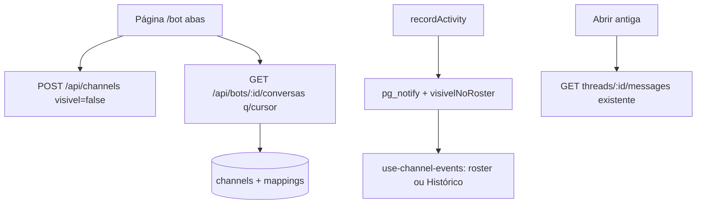

# Bot Histórico Design

**Spec**: `.specs/features/bot-historico/spec.md`
**Status**: Approved

---

## Architecture Overview

Hidden channels, not a new conversation table. Each bot conversation is a row in `channels` with `visivel_no_roster=false`; the roster excludes them server-side; a new endpoint lists them per bot with keyset pagination; the socket event carries visibility so the client routes instead of refetching.



---

## Code Reuse Analysis

### Existing Components to Leverage

| Component | Location | How to Use |
| --------- | -------- | ---------- |
| `ChannelStore.list/get/create/recordActivity` | `server/src/channels/routes.ts` | Extend: `visivel` on create, filter on list, flag on event |
| `isThreadReadableBy` | `server/src/channels/thread-history-routes.ts` | Reuse verbatim for the new endpoint's auth |
| Keyset cursor | `server/src/audit.ts:317-400` | Copy encode/decode shape, new cursor type over activity expression |
| Query parsing | `server/src/audit.ts:403-427` | Copy limit clamp 1..100, cursor param |
| `ChannelChat` + restore | `app/src/components/channels/channel-chat.tsx` | Embed for Conversa tab and read-only reopen |
| `channelKeys.list` + `useChannelEvents` | `app/src/lib/channels/` | Route by `visivelNoRoster`, add `botKeys.conversas` |
| `useStartChannel` | `app/src/lib/channels/start.ts` | Copy seed-cache + navigate pattern for Nova conversa |
| Channel tests | `server/tests/channel-routes.test.ts`, `channel-activity.integration.test.ts` | Same DB harness (`TEST_POOL`, per-file pool) |

### Integration Points

| System | Integration Method |
| ------ | ------------------ |
| `GET /api/channels` | Add `WHERE visivel_no_roster` — no shape change |
| Socket `ChannelActivityEvent` | Add `visivelNoRoster: boolean` — old clients ignore unknown field |
| Drizzle migrations | `db:generate` in `server/`, new `drizzle/NNNN_*.sql` |
| `/bot` route | Tabs around existing `CopilotChat` + new History list |

---

## Components

### Bot history store method

- **Purpose**: List one bot's hidden conversations with search + keyset page.
- **Location**: `server/src/channels/routes.ts` (new method on `ChannelStore`)
- **Interfaces**:
  - `listBotConversations(actor, agentId, { q?, cursor?, limit? }): Promise<{ items: ChannelSummary[], nextCursor?: string }>`
- **Dependencies**: `channels`, `channelMemberships`, `channelAgents`, `intelligenceChannelMappings`
- **Reuses**: `list()` join skeleton; `audit.ts` cursor mechanics

### Bot history routes

- **Purpose**: HTTP surface for the History tab.
- **Location**: `server/src/channels/bot-history-routes.ts` (new file)
- **Interfaces**:
  - `GET /api/bots/:id/conversas?q=&cursor=&limit=` → `{ conversas: ChannelSummary[], nextCursor? }`
  - `400` invalid cursor ("cursor de paginação inválido"); `404` same-shape for non-member/unknown
- **Dependencies**: store method + `isThreadReadableBy`
- **Reuses**: `auditQueryFromUrl` clamp pattern; `channelSummaryDto` shape

### Migration + schema

- **Purpose**: Visibility flag with partial index.
- **Location**: `server/src/db/schema/core.ts` + `server/drizzle/NNNN_*.sql`
- **Interfaces**: `channels.visivel_no_roster boolean not null default true`
- **Dependencies**: drizzle-kit generate
- **Reuses**: `channels_recent_activity_idx` comment convention

### History tab UI

- **Purpose**: Search + infinite list + read-only reopen + Continue.
- **Location**: `app/src/` — tabs in `routes/_authed/_app/bot.tsx`, list component near `components/channels/`, queries in `lib/channels/` (or `lib/bots/`)
- **Interfaces**:
  - `botKeys.conversas(botId, { q })`, `useBotConversas(botId, q)` (useInfiniteQuery, cursor param)
  - Item click → read-only `ChannelChat` (composer disabled) + Continue button
- **Dependencies**: `GET /api/bots/:id/conversas`; existing thread-messages restore
- **Reuses**: `matchingChannels` rule (search what the row shows); `transcriptMessages` seed pattern

### Realtime routing

- **Purpose**: Hidden activity updates History, never churns the roster.
- **Location**: `server/src/channels/events.ts` (type), `routes.ts` (emit), `app/src/lib/channels/use-channel-events.ts` (route)
- **Interfaces**: `ChannelActivityEvent.visivelNoRoster: boolean`
- **Dependencies**: socket hub + queryClient
- **Reuses**: existing patch/sort (`byRecency`) for the History list

---

## Data Models (if applicable)

### channels.visivel_no_roster

```typescript
visivelNoRoster: boolean("visivel_no_roster").notNull().default(true)
```

**Relationships**: No FK change. Partial index `WHERE visivel_no_roster = false` serves the History query; existing `channels_recent_activity_idx` serves ordering.

### History cursor

```typescript
interface BotHistoryCursor {
  activityAt: string // ISO-8601 of coalesce(last_message_at, created_at)
  id: string         // channel id tiebreak, DESC
}
```

Base64url-encoded like `audit.ts`. Keyset predicate on the same tuple as `ORDER BY ... DESC, id DESC`.

---

## Error Handling Strategy

| Error Scenario | Handling | User Impact |
| -------------- | -------- | ----------- |
| Invalid cursor | 400 dito error | History shows retry, keeps current page |
| Non-member / unknown bot | Same-shape 404 | No existence leak |
| Unknown `?agent=` | Dito missing-bot state | No empty chat |
| History fetch fails | Error state + retry, draft kept | Same rule as channel restore |
| Message between pages | Admit dup-top/absent-page-2 (EARS-07) | Documented, tested both directions |

---

## Tech Decisions (only non-obvious ones)

| Decision | Choice | Rationale |
| -------- | ------ | --------- |
| Hidden channel, not new table | `visivel_no_roster` flag | Reuses auth/restore/lastMessage; one source of truth |
| Cursor over activity tuple | `{activityAt, id}` DESC,DESC | Copies audit mechanics but matches mutable recency ordering |
| Phase-1 ILIKE only | `name` + `lastMessage` | Indexed-readable today; full-text is phase 2 without screen change |
| Event carries visibility | `visivelNoRoster` on payload | Lets client route; per-connection filtering out of scope |
